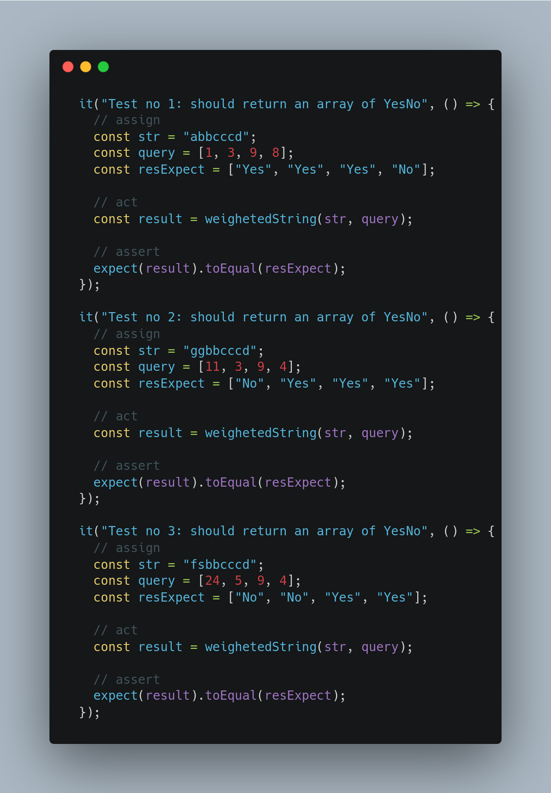
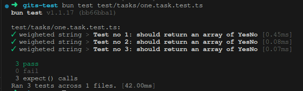
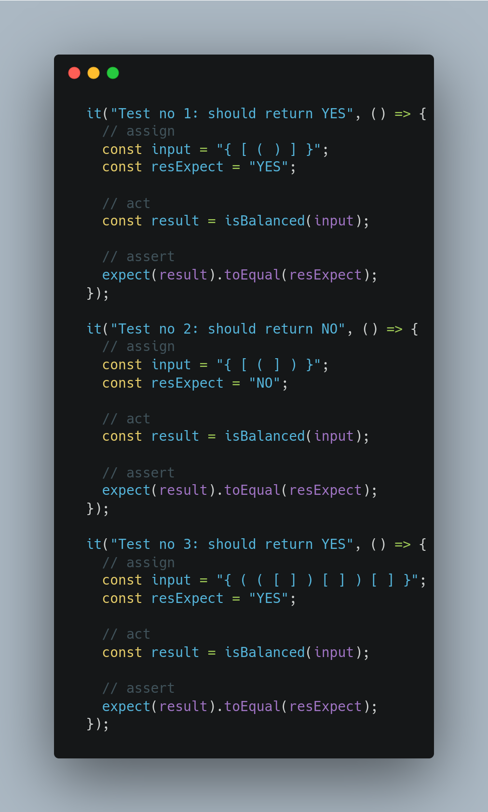
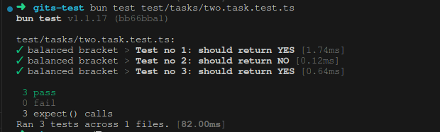
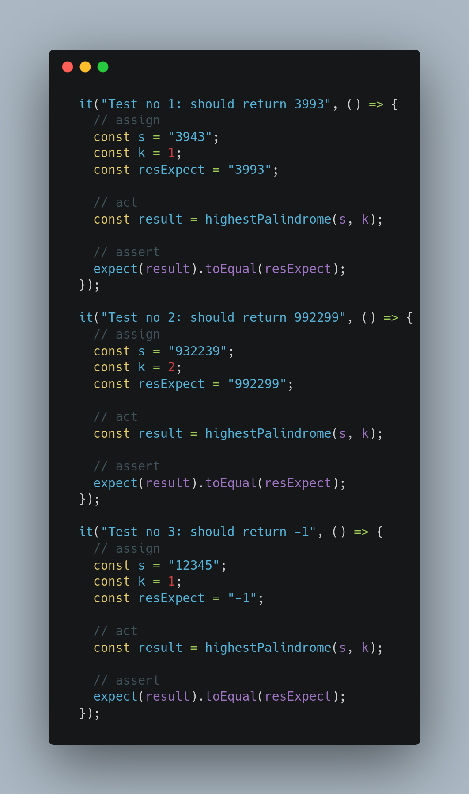
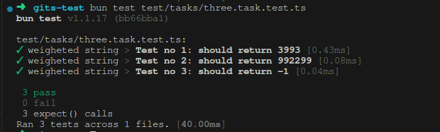

# gits-test

To install dependencies:

```bash
bun install
```

To run:

```bash
bun test
```

This project was created using `bun init` in bun v1.1.17. [Bun](https://bun.sh) is a fast all-in-one JavaScript runtime.

## 1. Weighted Strings

Code path:

```bash
src/tasks/one.task.ts
```

To test the code:

```bash
bun test test/tasks/one.task.test.ts
```

Screenshot inputs and results test:





## 2. Balanced Bracket

Code path:

```bash
src/tasks/two.task.ts
```

To test the code:

```bash
bun test test/tasks/two.task.test.ts
```

Screenshot input test:





Complexity analysis:
- Each character in the string is processed once
- In the worst case, the stack size can be up to half the size of the input string if all are opening brackets.

## 3.

Code path:

```bash
src/tasks/three.task.ts
```

To test the code:

```bash
bun test test/tasks/three.task.test.ts
```

Screenshot input test:




